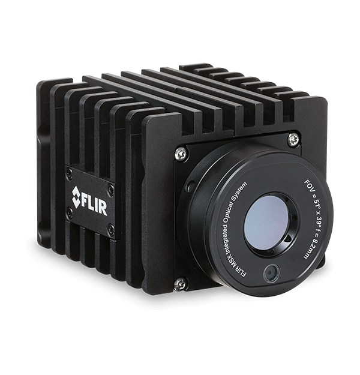

# flir_smart_camera_driver
# Package Summary

flir_smart_camera_driver

- Maintainer status: maintained

- Maintainer: Tahir Mehmood <tahir DOT mehmood AT mybotshop DOT de>

- Author: Tahir Mehmood <tahir DOT mehmood AT mybotshop DOT de>

- License: BSD

- Bug / feature tracker: https://github.com/driver/issues

- Source: git https://github.com/driver.git (branch: kinetic-devel)



## 1. Overview

The driver works with [A series cameras](https://www.flir.com/products/axxx-series-smart-sensor/) from Teledyne FLIR LLC.


## 2.Installation 

```bash
sudo pip3 install opencv-python
sudo pip3 install imutils
mkdir -p ~/catkin_ws/src && cd ~/catkin_ws/src
git clone https://github.com/flir_smart_camera_driver.git
# install dependencies
sudo apt update -qq
rosdep update
rosdep install --from-paths src --ignore-src -y
# build the workspace
catkin_make
# activate the workspace (ie: source it)
source devel/setup.bash
```

## 3. ROS Driver

The ROS driver is managed in two packages `flir_msgs` and `flir_smart_camera_driver`. 

```bash
roslaunch flir_smart_camera_driver driver.launch
```

### 3.1 Streaming Camera Nodes

#### 3.1.1 Parameters

 - ~api_file_path: Path to the REST api definition file. One by default exists in `flir_smart_camera_driver/config/swagger.json` which is downloaded from [here](https://flir.custhelp.com/app/answers/detail/a_id/5053/related/1).
    
 - ~camera_api_key: Every camera needs to authenticate the user data and requests. A guide on how to generate an API key can be found [here]().

 - ~camera_ip: IP address of the camera.

 - ~ir_format: Smart cameras provide data in different formats possible ones are: avc, mpeg4, mjpg

 - ~is_rgb_required: True if RGB image from the camera is required.

 - ~visual_format: Smart cameras provide data in different formats possible ones are: avc, mpeg4, mjpg

 - ~is_http: If the communication is http or https (can be changed in the cameras web interface)
       
 - ~overlay: Show/Hide camera overlay, includes different types of information in the overlay.
    
 - ~verbose: If true redirects API requests and json data to standard output.
    
#### 3.1.2 Published Topics

 - ~alarms/active([flir_msgs/ActiveAlarms](https://github.com/MYBOTSHOP/flir_smart_camera_driver/blob/main/flir_msgs/msg/ActiveAlarms.msg)): Information on any active alarms.

 - ~alarms/triggered([flir_msgs/TriggeredAlarms](https://github.com/MYBOTSHOP/flir_smart_camera_driver/blob/main/flir_msgs/msg/TriggeredAlarms.msg))

 - ~stream/ir([sensors_msgs/Image](http://docs.ros.org/en/noetic/api/sensor_msgs/html/msg/Image.html))
 
 - ~stream/rgb([sensors_msgs/Image](http://docs.ros.org/en/noetic/api/sensor_msgs/html/msg/Image.html))

#### 3.1.3 Services

As the driver is based on REST api and the device offer quite some fucntionalities there are two types of services:

1. Fetch information: All fetch services start with `get` and their namings exhibit their functionalities

2. Set attributes: All setattributes services start with `set` and need some data to set on the device.

 - ~get/alarms/digin([flir_msgs/RetrieveData](https://github.com/MYBOTSHOP/flir_smart_camera_driver/blob/main/flir_msgs/srv/RetrieveData.srv)):
 
 - ~get/alarms/digin/id([flir_msgs/IdRetrieveData](https://github.com/MYBOTSHOP/flir_smart_camera_driver/blob/main/flir_msgs/srv/IdRetrieveData.srv)):
 
 - ~get/alarms/measure_function([flir_msgs/RetrieveData](https://github.com/MYBOTSHOP/flir_smart_camera_driver/blob/main/flir_msgs/srv/RetrieveData.srv)):
 
 - ~get/alarms/measure_function/id([flir_msgs/IdRetrieveData](https://github.com/MYBOTSHOP/flir_smart_camera_driver/blob/main/flir_msgs/srv/IdRetrieveData.srv)):
 
 - ~get/alarms/temperature_sensor([flir_msgs/RetrieveData](https://github.com/MYBOTSHOP/flir_smart_camera_driver/blob/main/flir_msgs/srv/RetrieveData.srv)):
 
 - ~get/alarms/temperature_sensor/id([flir_msgs/IdRetrieveData](https://github.com/MYBOTSHOP/flir_smart_camera_driver/blob/main/flir_msgs/srv/IdRetrieveData.srv)):
 
 - ~get/device/configuration([flir_msgs/RetrieveData](https://github.com/MYBOTSHOP/flir_smart_camera_driver/blob/main/flir_msgs/srv/RetrieveData.srv)):
 
 - ~get/device/details([flir_msgs/RetrieveData](https://github.com/MYBOTSHOP/flir_smart_camera_driver/blob/main/flir_msgs/srv/RetrieveData.srv)):
 
 - ~get/device/focus([flir_msgs/RetrieveData](https://github.com/MYBOTSHOP/flir_smart_camera_driver/blob/main/flir_msgs/srv/RetrieveData.srv)):
 
 - ~get/device/io/outputs([flir_msgs/RetrieveData](https://github.com/MYBOTSHOP/flir_smart_camera_driver/blob/main/flir_msgs/srv/RetrieveData.srv)):
 
 - ~get/device/io/outputs/id([flir_msgs/RetrieveData](https://github.com/MYBOTSHOP/flir_smart_camera_driver/blob/main/flir_msgs/srv/RetrieveData.srv)):
 
 - ~get/device/limits([flir_msgs/RetrieveData](https://github.com/MYBOTSHOP/flir_smart_camera_driver/blob/main/flir_msgs/srv/RetrieveData.srv)):
 
 - ~get/device/nuc([flir_msgs/RetrieveData](https://github.com/MYBOTSHOP/flir_smart_camera_driver/blob/main/flir_msgs/srv/RetrieveData.srv)):
 
 - ~get/image/state([flir_msgs/RetrieveData](https://github.com/MYBOTSHOP/flir_smart_camera_driver/blob/main/flir_msgs/srv/RetrieveData.srv)):
 
 - ~get/measurements/boxes([flir_msgs/RetrieveData](https://github.com/MYBOTSHOP/flir_smart_camera_driver/blob/main/flir_msgs/srv/RetrieveData.srv)):
 
 - ~get/measurements/boxes/id([flir_msgs/RetrieveData](https://github.com/MYBOTSHOP/flir_smart_camera_driver/blob/main/flir_msgs/srv/RetrieveData.srv)):
 
 - ~get/measurements/deltas([flir_msgs/RetrieveData](https://github.com/MYBOTSHOP/flir_smart_camera_driver/blob/main/flir_msgs/srv/RetrieveData.srv)):
 
 - ~get/measurements/deltas/id([flir_msgs/RetrieveData](https://github.com/MYBOTSHOP/flir_smart_camera_driver/blob/main/flir_msgs/srv/RetrieveData.srv)):
 
 - ~get/measurements/lines([flir_msgs/RetrieveData](https://github.com/MYBOTSHOP/flir_smart_camera_driver/blob/main/flir_msgs/srv/RetrieveData.srv)):
 
 - ~get/measurements/lines/id([flir_msgs/IdRetrieveData](https://github.com/MYBOTSHOP/flir_smart_camera_driver/blob/main/flir_msgs/srv/IdRetrieveData.srv)):
 
 - ~get/measurements/polylines([flir_msgs/RetrieveData](https://github.com/MYBOTSHOP/flir_smart_camera_driver/blob/main/flir_msgs/srv/RetrieveData.srv)):
 
 - ~get/measurements/polylines/id([flir_msgs/RetrieveData](https://github.com/MYBOTSHOP/flir_smart_camera_driver/blob/main/flir_msgs/srv/RetrieveData.srv)):
 
 - ~get/measurements/reftemps([flir_msgs/RetrieveData](https://github.com/MYBOTSHOP/flir_smart_camera_driver/blob/main/flir_msgs/srv/RetrieveData.srv)):
 
 - ~get/measurements/reftemps/id([flir_msgs/RetrieveData](https://github.com/MYBOTSHOP/flir_smart_camera_driver/blob/main/flir_msgs/srv/RetrieveData.srv)):
 
 - ~get/measurements/spots([flir_msgs/RetrieveData](https://github.com/MYBOTSHOP/flir_smart_camera_driver/blob/main/flir_msgs/srv/RetrieveData.srv)):
 
 - ~get/measurements/spots/id([flir_msgs/RetrieveData](https://github.com/MYBOTSHOP/flir_smart_camera_driver/blob/main/flir_msgs/srv/RetrieveData.srv)):
 
 - ~get/regional/limits([flir_msgs/RetrieveData](https://github.com/MYBOTSHOP/flir_smart_camera_driver/blob/main/flir_msgs/srv/RetrieveData.srv)):
 
 - ~get/regional/time([flir_msgs/RetrieveData](https://github.com/MYBOTSHOP/flir_smart_camera_driver/blob/main/flir_msgs/srv/RetrieveData.srv)):
 
 - ~get/regional/units([flir_msgs/RetrieveData](https://github.com/MYBOTSHOP/flir_smart_camera_driver/blob/main/flir_msgs/srv/RetrieveData.srv)):
 
 - ~get/screening/configuration([flir_msgs/RetrieveData](https://github.com/MYBOTSHOP/flir_smart_camera_driver/blob/main/flir_msgs/srv/RetrieveData.srv)):
 
 - ~get/screening/limits([flir_msgs/RetrieveData](https://github.com/MYBOTSHOP/flir_smart_camera_driver/blob/main/flir_msgs/srv/RetrieveData.srv)):
 
 - ~get/screening/operator/configuration([flir_msgs/RetrieveData](https://github.com/MYBOTSHOP/flir_smart_camera_driver/blob/main/flir_msgs/srv/RetrieveData.srv)):
 
 - ~get/screening/operator/state([flir_msgs/RetrieveData](https://github.com/MYBOTSHOP/flir_smart_camera_driver/blob/main/flir_msgs/srv/RetrieveData.srv)):

 - ~set/alarms/digin/id([flir_msgs/DiginAlarm](https://github.com/MYBOTSHOP/flir_smart_camera_driver/blob/main/flir_msgs/srv/DiginAlarm.srv)):

 - ~set/alarms/measure_function/id([flir_msgs/MeasureFunctionAlarm](https://github.com/MYBOTSHOP/flir_smart_camera_driver/blob/main/flir_msgs/srv/MeasureFunctionAlarm.srv)): 
 
 - ~set/alarms/temperature_sensor/id([flir_msgs/TempSensAlarm](https://github.com/MYBOTSHOP/flir_smart_camera_driver/blob/main/flir_msgs/srv/TempSensAlarm.srv)):

 - ~set/device/configuration([flir_msgs/DeviceConfiguration](https://github.com/MYBOTSHOP/flir_smart_camera_driver/blob/main/flir_msgs/srv/DeviceConfiguration.srv)):

 - ~set/device/details([flir_msgs/DeviceDetails](https://github.com/MYBOTSHOP/flir_smart_camera_driver/blob/main/flir_msgs/srv/DeviceDetails.srv)):

 - ~set/device/focus([flir_msgs/DeviceFocusUpdate](https://github.com/MYBOTSHOP/flir_smart_camera_driver/blob/main/flir_msgs/srv/DeviceFocusUpdate.srv)):

 - ~set/device/focus_auto([flir_msgs/DeviceFocusAutoUpdate](https://github.com/MYBOTSHOP/flir_smart_camera_driver/blob/main/flir_msgs/srv/DeviceFocusAutoUpdate.srv)):

 - ~set/device/io/outputs/id([flir_msgs/DigitalOutput](https://github.com/MYBOTSHOP/flir_smart_camera_driver/blob/main/flir_msgs/srv/DigitalOutput.srv)):

 - ~set/device/nuc([flir_msgs/DeviceNuc](https://github.com/MYBOTSHOP/flir_smart_camera_driver/blob/main/flir_msgs/srv/DeviceNuc.srv)):

 - ~set/device/pts/pan([flir_msgs/DevicePan](https://github.com/MYBOTSHOP/flir_smart_camera_driver/blob/main/flir_msgs/srv/DevicePan.srv)):

 - ~set/device/pts/stop([flir_msgs/RetrieveData](https://github.com/MYBOTSHOP/flir_smart_camera_driver/blob/main/flir_msgs/srv/RetrieveData.srv)):

 - ~set/device/pts/tilt([flir_msgs/DeviceTilt](https://github.com/MYBOTSHOP/flir_smart_camera_driver/blob/main/flir_msgs/srv/DeviceTilt.srv)):

 - ~set/image/state([flir_msgs/ImageState](https://github.com/MYBOTSHOP/flir_smart_camera_driver/blob/main/flir_msgs/srv/ImageState.srv)):

 - ~set/measurements/boxes/id([flir_msgs/FunctionBox](https://github.com/MYBOTSHOP/flir_smart_camera_driver/blob/main/flir_msgs/srv/FunctionBox.srv)):

 - ~set/measurements/deltas/id([flir_msgs/FunctionDelta](https://github.com/MYBOTSHOP/flir_smart_camera_driver/blob/main/flir_msgs/srv/FunctionDelta.srv)):

 - ~set/measurements/lines/id([flir_msgs/FunctionLine](https://github.com/MYBOTSHOP/flir_smart_camera_driver/blob/main/flir_msgs/srv/FunctionLine.srv)):

 - ~set/measurements/polylines/id([flir_msgs/FunctionPolyline](https://github.com/MYBOTSHOP/flir_smart_camera_driver/blob/main/flir_msgs/srv/FunctionPolyline.srv)):

 - ~set/measurements/reftemps/id([flir_msgs/FunctionRefTemp](https://github.com/MYBOTSHOP/flir_smart_camera_driver/blob/main/flir_msgs/srv/FunctionRefTemp.srv)):

 - ~set/measurements/spots/id([flir_msgs/FunctionSpot](https://github.com/MYBOTSHOP/flir_smart_camera_driver/blob/main/flir_msgs/srv/FunctionSpot.srv)):

 - ~set/regional/time([flir_msgs/RegionalTime](https://github.com/MYBOTSHOP/flir_smart_camera_driver/blob/main/flir_msgs/srv/RegionalTime.srv)):

 - ~set/regional/units([flir_msgs/RegionalUnits](https://github.com/MYBOTSHOP/flir_smart_camera_driver/blob/main/flir_msgs/srv/RegionalUnits.srv)):

 - ~set/screening/configuration([flir_msgs/ScreeningConfiguration](https://github.com/MYBOTSHOP/flir_smart_camera_driver/blob/main/flir_msgs/srv/ScreeningConfiguration.srv)):

 - ~set/screening/operator/capture_sample([flir_msgs/RetrieveData](https://github.com/MYBOTSHOP/flir_smart_camera_driver/blob/main/flir_msgs/srv/RetrieveData.srv)):

 - ~set/screening/operator/configuration([flir_msgs/ScreeningOperatorConfiguration](https://github.com/MYBOTSHOP/flir_smart_camera_driver/blob/main/flir_msgs/srv/ScreeningOperatorConfiguration.srv)):

 - ~set/screening/operator/reset_samples([flir_msgs/RetrieveData](https://github.com/MYBOTSHOP/flir_smart_camera_driver/blob/main/flir_msgs/srv/RetrieveData.srv)):